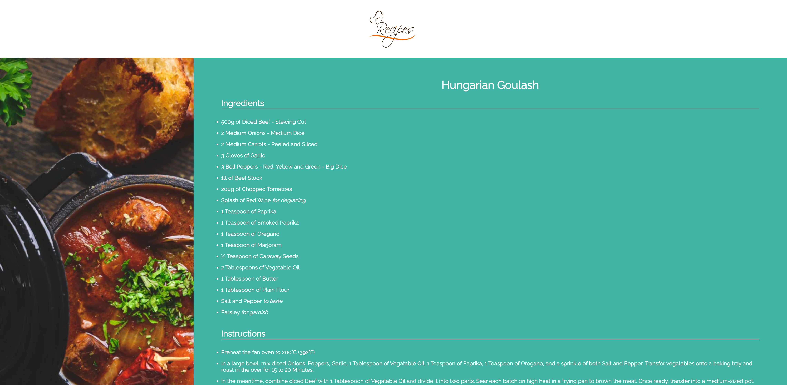

# Recipes | The Odin Project
Basic HTML and CSS-based Website designed for The Odin Project's Foundation Path.

I hope you enjoy these three recipes. I originally found them on Reddit, along with the images and I have made the Hungarian Goulash recipe, as well as the Ultimate Gooey Chocolate Brownies recipe, and enjoyed them both! I'll add original credit below soon.

*Tip for the Hungarian Goulash - Double the Paprika and Smoked Paprika Measurements!*

## Homepage

## Recipe Page

